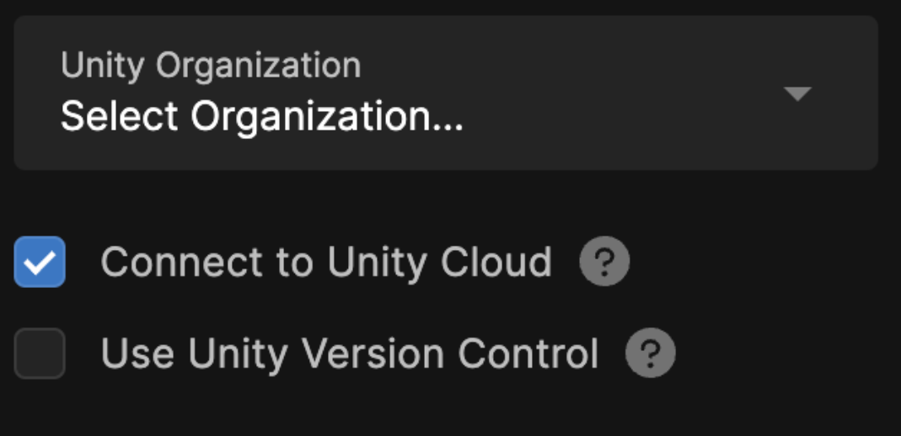
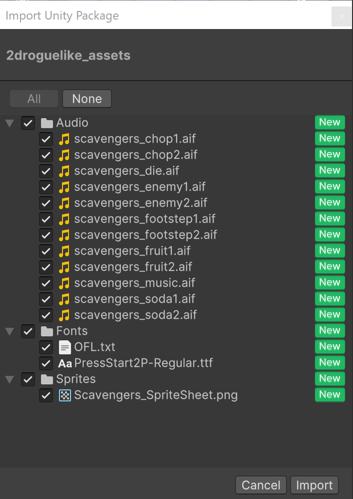

## 1.1 What you will be learning ?

By the end of this workshop. You would have learnt to create a 2D roguelike game. A roguelike is a traditional game genre that has taken many forms over the years, but it usually shares some common elements, such as the following:

- It’s procedurally generated, meaning the levels in the game aren't created by a human and thus always the same, but instead they’re assembled randomly by the code, so every time the game is played, the levels are different.
- The game is played on a grid, meaning all entities (player and enemies) move from cell to cell on that grid.
- The game is turn-based, meaning nothing will happen until the player takes an action (move, attack, etc.), which gives players the chance to think strategically between each action.

In this tutorial, you’ll start by creating the Unity project for this game. You’ll then import the assets that will be used throughout the tutorial, set up all the settings for rendering, and set up Unity Version Control. Lastly, before you start creating, you’ll organize ideas about the game to create a plan on how to make it.

## 1.2 Preparing for the project

To create your project and get it ready to work on, follow these instructions:

**1.** Open the Unity Hub and install Unity 6.

**2.** Create a new project using Editor version 6.000 LTS, name it “Roguelike”, and select the **Universal 2D** template.

**3.** Enable **Connect to Unity Cloud** and **Use Unity Version Control**.

This will allow you to use Unity Cloud and Unity Version Control in your project.

**4.** Select **Create project**.

- Once your new Roguelike project is open in Unity, you need to change some default settings for this project.

**5.** In the **Project** window, select **Assets** > **Settings**, then select the **Renderer2D** file.

- This is all the settings used by the rendering pipeline to display your assets in the game.

**6.** In the **Inspector** window, under the **General** section, change the **Default Material Type** from **Lit** to **Unlit**.

- Lit materials are affected by dynamic lighting, where lights can move and be switched on and off for a more realistic look. But Lit materials require additional computation in order to be rendered. As this project uses a traditional pixel art style, where lighting is drawn directly on the sprite, dynamic lighting isn't needed, so Unlit materials should be used, because they are easier and faster to render.
- Now every time a new sprite is created, it will be assigned an Unlit material automatically instead of a Lit one.

Your project is now set up for you to start working on it.

## 1.3 Importing Assets

- Download [the asset package](https://unity-connect-prd.storage.googleapis.com/20241025/13b51e19-dc52-4982-b67a-fdfb35c7a3b8/Roguelike2DTutorialAssets.unitypackege.zip), unzip the file and drag and drop it into the **Assets** folder of the **Project** window.
- The **Import Unity Package** window will open, listing all the assets this package will import into your project.

