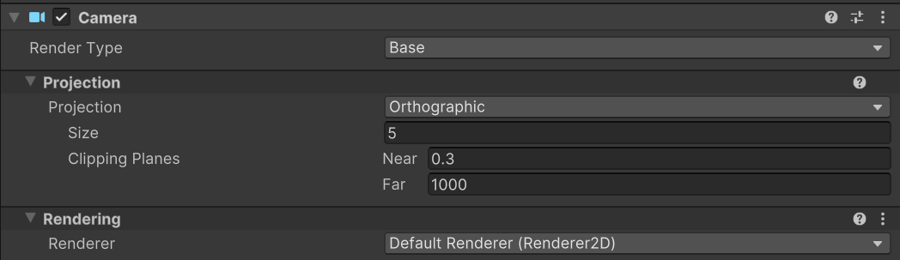
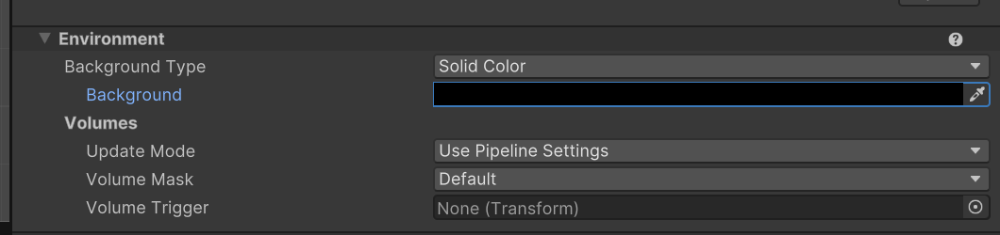
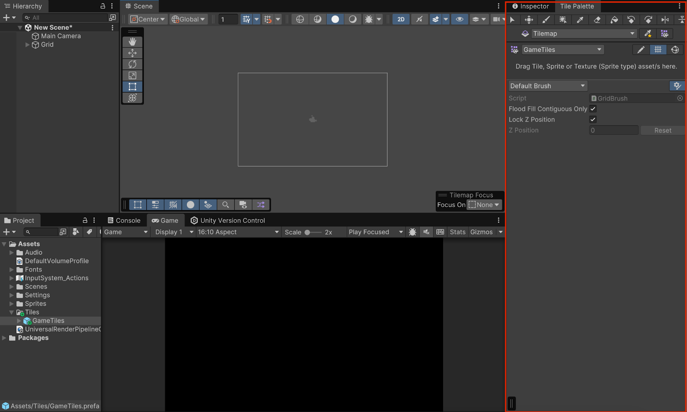
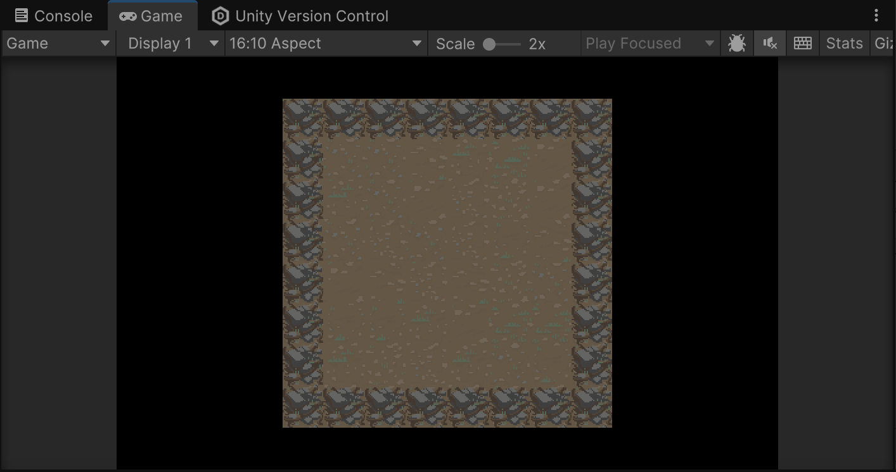
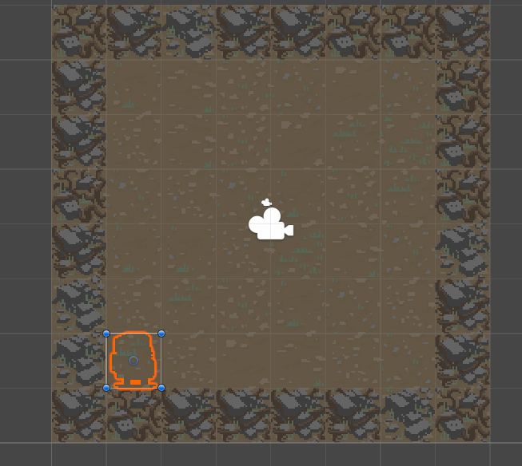

# Game Development 101- ACM Workshop

# 1. Overview

Unity is a cross-platform game engine used to develop 2D, 3D, AR, and VR applications . It abstracts low-level systems (rendering, physics, memory, input) and provides a component-based framework for building interactive applications using C#.

## 1.1 What you will be learning ?

By the end of this workshop. You would have learnt to create a 2D roguelike game. A roguelike is a traditional game genre that has taken many forms over the years, but it usually shares some common elements, such as the following:

- It’s procedurally generated, meaning the levels in the game aren't created by a human and thus always the same, but instead they’re assembled randomly by the code, so every time the game is played, the levels are different.
- The game is played on a grid, meaning all entities (player and enemies) move from cell to cell on that grid.
- The game is turn-based, meaning nothing will happen until the player takes an action (move, attack, etc.), which gives players the chance to think strategically between each action.

In this tutorial, you’ll start by creating the Unity project for this game. You’ll then import the assets that will be used throughout the tutorial, set up all the settings for rendering, and set up Unity Version Control. Lastly, before you start creating, you’ll organize ideas about the game to create a plan on how to make it.

## 1.2 Preparing for the project

To create your project and get it ready to work on, follow these instructions:

**1.** Open the Unity Hub and install Unity 6.

**2.** Create a new project using Editor version 6.000 LTS, name it “Roguelike”, and select the **Universal 2D** template.

**3.** Enable **Connect to Unity Cloud** and **Use Unity Version Control**.


This will allow you to use Unity Cloud and Unity Version Control in your project.

**4.** Select **Create project**.

- Once your new Roguelike project is open in Unity, you need to change some default settings for this project.

**5.** In the **Project** window, select **Assets** > **Settings**, then select the **Renderer2D** file.

- This is all the settings used by the rendering pipeline to display your assets in the game.

**6.** In the **Inspector** window, under the **General** section, change the **Default Material Type** from **Lit** to **Unlit**.

- Lit materials are affected by dynamic lighting, where lights can move and be switched on and off for a more realistic look. But Lit materials require additional computation in order to be rendered. As this project uses a traditional pixel art style, where lighting is drawn directly on the sprite, dynamic lighting isn't needed, so Unlit materials should be used, because they are easier and faster to render.
- Now every time a new sprite is created, it will be assigned an Unlit material automatically instead of a Lit one.

Your project is now set up for you to start working on it.

## 1.3 Importing Assets

- Download [the asset package](https://unity-connect-prd.storage.googleapis.com/20241025/13b51e19-dc52-4982-b67a-fdfb35c7a3b8/Roguelike2DTutorialAssets.unitypackege.zip), unzip the file and drag and drop it into the **Assets** folder of the **Project** window.
- The **Import Unity Package** window will open, listing all the assets this package will import into your project.


# 2. Creating the game

Now you’ll start working on the game itself. The first thing you’ll need to do is generate a game board through code.

## 2.1 Creating the game board

1. The provided project should already contain a **Scenes** folder, but if it doesn’t, in the **Project** window, right-click the **Assets** folder and select **Create** > **Folder** and name it “Scenes”.
2. Right-click the **Scenes** folder and select **Create** > **Scene** > **Scene** to create a new empty scene, and name it “Main”.
3. Double click **Main** scene to open it. In the **Hierarchy** window, select the **Main** **Camera** GameObject, then in the **Inspector** window, under the **Camera** section, ensure that the **Projection** property is set to **Orthographic** and the **Size** property is set to **5**.



1. Under the **Environment** section of the **Camera** settings, ensure the **Background Type** property is set to **Solid Color** and set the **Background Color** property to black (**000000**).



1. Right-click in the **Hierarchy** window and select **2D Object** > **Tilemap** > **Rectangular**.
2. In the **Project** window, right-click the **Assets** folder and select **Create** > **Folder** to create a new folder, then name it “Tiles”. Right-click the **Tiles** folder and select **Create** > **2D** > **Tile Palette** > **Rectangular** and name the new asset “GamePalette”.
3. From the main menu, select **Window** > **2D** > **Tile Palette**.
    
    This opens the **Tile Palette** window.
    



1. In the **Project** window, select **Assets** > **Roguelike2D** > **TutorialAssets** > **Sprites**. Choose whichever Sprite Sheet you want, use the foldout (triangle) to expand it, and select and drop all the ground tiles into the center of the **Tile Palette** window.

The Editor will ask you to select a folder where you want the new tiles to be saved; select the **Tiles** folder you just created.

## 2.2 Scripting

Now that you have your ground tiles, let’s write the code that creates the board where the game will happen on each level:

**1.** In the **Hierarchy** window, rename the **Grid** GameObject “BoardManager”.

**2.** In the **Project** window, right-click the **Assets** folder and select **Create** > **Folder** and name it “Scripts”.

**3.** Right-click the **Scripts** folder and select **Create** > **Scripting** > **MonoBehaviour Script**, name it “BoardManager”, and add it as a component of the **BoardManager** GameObject.

**4.** Double-click the new **BoardManager** script to open it in your code editor.

You’ll need to create the following three variables that you can set in the Editor:

- The width (in number of tiles) of our level.
- The height (in number of tiles) of our level.
- An array of tiles that are going to be used for the board.

First, in the **Start** method, you need to get the Tilemap component from the child GameObjects of the GameObject the script is on (the **Tilemap** GameObejct is a child GameObject of the **BoardManager** GameObject) and store it in a private member variable for easy access later. Then the code needs to go over all the tiles in the Tilemap component and randomly select a ground tile.

The method to set a tile from a tilemap is **SetTile**, which takes as first parameter a Vector3 Int with the coordinates of the tile (so (0,0,0) is the first cell, (1,0,0) the one on its right, (0,-1, 0) the one below etc. z is always 0 in this case as you work in 2D) and the second parameter is the actual tile to be set at that position.

**Note**: Don’t forget to add the **using UnityEngine.Tilemaps** namespace at the beginning of your file so you can have access to the Tilemap and Tile classes.

Here is the solution:

```csharp
using UnityEngine;
using UnityEngine.Tilemaps;

public class BoardManager : MonoBehaviour
{
	private Tilemap m_Tilemap;
	
	public int Width;
	public into Height;
	public Tile[] GroundTiles;
	
	//Start is called before first frame update
	void Start()
	{
		m_Tilemap = GetComponentInChildren<Tilemap>();
		
		for (int y = 0; y < Height; ++y)
		{
			for (int x = 0; x < Width; ++x)
			{
				int tileNumber = Random.Range(0, GroundTiles.Length);
				m_Tilemap.SetTitle(new Vector3Int(x,y,0),GroundTiles[titleNumber]);
			}
		}
	}
}
```

5.  After completing your script, make sure to save it to compile the changes so they are visible in the Editor.

**6.**  Select the **BoardManager** GameObject. In the **Inspector** window, set the **width** and **height** variables of the Board Manager script component to **8**.

**7.**  Use the foldout (triangle) to expand the Ground Tiles section, then select the **Add** (**+**) button. Use the picker (**⊙**) and select a tile for the ground. Try to add a couple of different tiles.

**8.**  In the **Game** view toolbar, select the **Play** button to enter Play mode.

You can now see the game board in both the **Scene** view and the **Game** view!

Note that the **Game** view will only show part of the board, but you will fix the camera later!

```csharp
voidStart()
{       

m_Tilemap=GetComponentInChildren<Tilemap>();

for(int y=0; y< Height;++y)
{
for(int x=0; x< Width;++x)
{
Tile tile;
if(x==0|| y==0|| x== Width-1|| y== Height-1)
{                   
tile= WallTiles[Random.Range(0, WallTiles.Length)];
}
else
{                   
tile= GroundTiles[Random.Range(0, GroundTiles.Length)];
}
m_Tilemap.SetTile(newVector3Int(x, y,0), tile);
}
}
}
}
```

## 2.3 Camera

As your tilemap is at **0**,**0**,**0**, and it is **8** by **8**, its center is at (**4**,**4**,**0**) so set the **Main Camera Position** to (**4**,**4**,**-10**) so it aims at the center of your board.

Now, when you try to enter Play mode, your board will look something like this:



## 2.4 Board Data

- As of now, your board is only a collection of tiles, which are just visual. For the game to really function, you'll need to keep more data for each cell than just its sprites.
- To do this, you'll use a 2D array, which is an array that has two indices (in this case, the x and y of the cell). This array type will be a custom C# class, which will allow you to store any kind of data per cell.
- At the top of your **BoardManager** class, add a new class called “CellData” and make its first member variable a boolean that defines if the cell is passable or not. And then let’s declare a private property that is our 2D array board data that we will name **m_BoardData**.

```csharp
public class BoardManager:MonoBehaviour
{
public class CellData
{
public bool Passable;
}
privateCellData[,] m_BoardData;
}
```

- **CellData[,]** is the way to declare a 2D array containing objects of type **CellData**. The “,” denotes there will be two indices to access it. So **m_BoardData[0,0]** is the first item of the first line, **m_BoardData[1,3]** the fourth item of the second line (indices start at 0!), etc.
- In C# you can create an array of any dimension, so **CellData[,,]** would be a 3D array (three indices)
- Finally you can update your **Start** method. To do this, you’ll need to do the following:
    - Initialize the m_BoardData array with your board width/height so it’s size is enough to store the data of all the cells.
    - Create each CellData inside your loops and set its Passable value to **true** if the cell is not a border and **false** if it is a border.

```csharp
voidStart()
{    
m_Tilemap=GetComponentInChildren<Tilemap>();
m_BoardData=newCellData[Width, Height];
for(int y=0; y< Height;++y)
{
for(int x=0; x< Width;++x)
{
Tile tile;            
m_BoardData[x, y]=newCellData();
if(x==0|| y==0|| x== Width-1|| y== Height-1)
{                
tile= WallTiles[Random.Range(0, WallTiles.Length)];                
m_BoardData[x, y].Passable=false;
}
else
{                
tile= GroundTiles[Random.Range(0, GroundTiles.Length)];                
m_BoardData[x, y].Passable=true;
}
m_Tilemap.SetTile(newVector3Int(x, y,0), tile);
}
}
}
```

# 3. Character Development

## 3.1 Adding Player Character

To add a **PlayerCharacter**

**1.** Choose one of the player character sprites in the Sprite Sheet in the **Assets** > **Roguelike2D** > **TutorialAssets** > **Sprites** folder and drag it into the scene to automatically create a new GameObject with a Sprite Renderer component using that sprite. Rename that GameObject “PlayerCharacter”.

**2.** Inside the **Scripts** folder, create a new MonoBehaviour script called “PlayerController” and add it to the **PlayerCharacter** GameObject you just created.

- At the start, the board sets the player on a specific cell after it finishes generating the level.
- When the user presses a direction button (up, down, left, or right arrow keys), the script checks if the cell in that direction is passable.
- If the cell is passable, the script moves the character to that new cell.

This outline should help you realize the following about what your code needs to do to achieve this functionality:

- When the board places the player character, the player character will need a **Spawn** method that will move it to the right spot.
- The script needs to know where the player character currently is in order to search for the next cells the player character can move to, so it will need to store its current cell index.
- As the script needs to know if the cell the player character is trying to move to is passable, and that information is stored in the **BoardManager**, the script will need to store a reference to the **BoardManager** to query it about the state of a given cell.

**3.** Inside your new **PlayerController** script, add the following methods and variables:

- A private variable of type **BoardManager**.
- A private variable of type **Vector2Int** that saves the current cell the player is on.
- A public method called “Spawn” that saves the BoardManager that the player is placed in and the index where it is currently.

```csharp
usingUnityEngine;

public class PlayerController:MonoBehaviour
{
private BoardManager m_Board; 
private Grid m_Grid;
private Vector2Int m_CellPosition;
public Vector3 CellToWorld(Vector2Int cellIndex)
    {
        return m_Grid.GetCellCenterWorld((Vector3Int)cellIndex);
    }
public void Spawn(BoardManager boardManager,Vector2Int cell)
{       
m_Board= boardManager;       
m_CellPosition= cell;
public void Spawn(BoardManager boardManager, Vector2Int cell)
{
   m_Board = boardManager;
   m_CellPosition = cell;

   //let's move to the right position
   transform.position = m_Board.CellToWorld(cell);
}
```

1. Add the following code into your BoardManager Script:

```csharp
public PlayerController Player;
// Start is called before the first frame update 
voidStart()
{   
m_Tilemap=GetComponentInChildren<Tilemap>();   
m_Grid=GetComponentInChildren<Grid>();
m_BoardData=newCellData[Width, Height];
for(int y=0; y< Height;++y)
{
for(int x=0; x< Width;++x)
{
Tile tile;           
m_BoardData[x, y]=newCellData();
if(x==0|| y==0|| x== Width-1|| y== Height-1)
{               
tile= WallTiles[Random.Range(0, WallTiles.Length)];               
m_BoardData[x, y].Passable=false;
}
else
{               
tile= GroundTiles[Random.Range(0, GroundTiles.Length)];               
m_BoardData[x, y].Passable=true;
}
m_Tilemap.SetTile(newVector3Int(x, y,0), tile);
}
}
Player.Spawn(this,newVector2Int(1,1));
}
```

The above code does the following things:

- Adds a public member variable (**PlayerController)** to the **BoardManager** so you can assign your **PlayerCharacter** GameObject to it in the **Inspector** window.
- At the end of the **Start** method, after the board is generated, it calls the **Spawn** method on that **PlayerController** script with a given cell (for example (1,1) the first lower-left cell that is not a wall).
1. In the Editor, drag the **PlayerCharacter** GameObject from the scene into the **Player** slot on the **BoardManager** script, then enter Play mode.


**7.** Select the **PlayerCharacter** GameObject in the **Hierarchy** window and look at the **Scene** view.

You'll see that your player character is in the right place, but the board is rendered above it:



**8.** In the **Inspector** window, use the foldout (triangle) to expand the Sprite Renderer component and set the **Order in Layer** property **10**.

Setting the player character to level 10 gives you space in the future to place objects that should be above the board but under the player character.


## 3.2 Moving Player Character

The PlayerController script will need to do the following:

- Inside the **Update** method of the **PlayerController** script, check if an arrow key is pressed.
- Check if the cell in that direction is passable.
- If the cell is passable, move the player to the new cell.

The code below shows one possible way of doing this.

 Note that you’ll need to add the **UnityEngine.InputSystem** library at the top of your file:

```csharp
private void Update()
{
Vector2Int newCellTarget= m_CellPosition;
bool hasMoved=false;
if(Keyboard.current.upArrowKey.wasPressedThisFrame)
{       
newCellTarget.y+=1;       
hasMoved=true;
}
else if(Keyboard.current.downArrowKey.wasPressedThisFrame)
{       
newCellTarget.y-=1;       
hasMoved=true;
}
else if(Keyboard.current.rightArrowKey.wasPressedThisFrame)
{       
newCellTarget.x+=1;       
hasMoved=true;
}
else if(Keyboard.current.leftArrowKey.wasPressedThisFrame)
{       
newCellTarget.x-=1;       
hasMoved=true;
}
if(hasMoved)
{
//check if the new position is passable, then move there if it is.}}
```

Just like with the **BoardManager** GameObject, you have no way of getting the information about whether a cell is passable. As before, retrieving the cell data of a specific cell is something you'll need to do a lot, so add the following method for this to your **BoardManager** script:

```csharp
public CellData GetCellData(Vector2Int cellIndex) 
{
if(cellIndex.x<0|| cellIndex.x>= Width|| cellIndex.y<0|| cellIndex.y>= Height)
{
return null;
}
return m_BoardData[cellIndex.x, cellIndex.y];
}
```

This method returns the information saved on the array **m_BoardData** of that cell. Restricting the search on the array to only the actual cells available in that level so you don’t generate an exception trying to index a cell that doesn’t exist. In that case, the method returns null.

You can now update your **Update** method in your **PlayerController** script so it uses the following method:

```csharp
private void Update()
{
Vector2Int new CellTarget= m_CellPosition;
bool hasMoved=false;
if(Keyboard.current.upArrowKey.wasPressedThisFrame)
{        
newCellTarget.y+=1;        
hasMoved=true;
}
else if(Keyboard.current.downArrowKey.wasPressedThisFrame)
{        
newCellTarget.y-=1;        
hasMoved=true;
}
else if(Keyboard.current.rightArrowKey.wasPressedThisFrame)
{        
newCellTarget.x+=1;        
hasMoved=true;
}
else if(Keyboard.current.leftArrowKey.wasPressedThisFrame)
{        
newCellTarget.x-=1;        
hasMoved=true;
}
if(hasMoved)
{
//check if the new position is passable, then move there if it 
is.BoardManager.CellData cellData= m_Board.GetCellData(newCellTarget);
if(cellData!=null&& cellData.Passable)
{
m_CellPosition= newCellTarget;            
transform.position= m_Board.CellToWorld(m_CellPosition);
}
}
}
```

## 3.3 Refactoring

- In a prototyping environment like this one, where you keep finding solutions to problems that appear as you progress, it’s good to take a second to look at your code and check if you have areas that you can clean up.
- In this case, you may have noticed some code duplication: you move the player in the **Spawn** method and also later in the **Update** method.
- Code duplication is not always bad, but in this case it could create errors: when the character moves, both the **CellPosition** and the **Transform** position need to be updated. It would be easy to forget one of the two if you need to move the character elsewhere in the code. Plus, there might be things you want to add to your code later; for example, adding a sound every time the character moves. To do this, you would have to track every place you move the character to add that sound.
- It would be safer and more efficient to wrap all of that functionality into a **MoveTo** method that takes a new cell the player will move to as a parameter and takes care of everything related to moving the **PlayerCharacter** GameObject.
- Copy and paste the **MoveTo** method code below into your **PlayerController** script to add that method and replace both movements in the **Start** and **Update** methods with it:

```csharp
using UnityEngine;
using UnityEngine.InputSystem;
public class PlayerController:MonoBehaviour
{
private BoardManager m_Board;
private Vector2Int m_CellPosition;
public void Spawn(BoardManager boardManager,Vector2Int cell)
{       
m_Board= boardManager;MoveTo(cell);
}
public void MoveTo(Vector2Int cell)
{       
m_CellPosition= cell;       
transform.position= m_Board.CellToWorld(m_CellPosition);
}

private voidUpdate()
{
Vector2Int newCellTarget= m_CellPosition;
bool hasMoved=false;
if(Keyboard.current.upArrowKey.wasPressedThisFrame)
{           
newCellTarget.y+=1;           
hasMoved=true;
}
else if(Keyboard.current.downArrowKey.wasPressedThisFrame)
{           
newCellTarget.y-=1;           
hasMoved=true;
}
else if(Keyboard.current.rightArrowKey.wasPressedThisFrame)
{           
newCellTarget.x+=1;           
hasMoved=true;
}
else if(Keyboard.current.leftArrowKey.wasPressedThisFrame)
{           
newCellTarget.x-=1;           
hasMoved=true;
}
if(hasMoved)
{
//check if the new position is passable, then move there if it 
is.BoardManager.CellData cellData= m_Board.GetCellData(newCellTarget);
if(cellData!=null&& cellData.Passable){MoveTo(newCellTarget);
}
}
}
}
```

# 4. Adding a Turn System

## 4.1 Turn Manager

- If you go back to your list of tasks, the next step after having a moving player is implementing a turn system when the player character makes a move.
- To create a turn system, follow these instructions:
    
    **1.** Right-click the **Scripts** folder in the **Project** window and select **Create** > **Scripting** > **Empty C# Script**. Name this script “**TurnManager**”
    
    In this instance, you don’t need to use a MonoBehaviour script because, unlike the other scripts you’ve written so far, this one is a pure data class that just handles data and is not linked to a GameObject, so it doesn’t need to inherit from MonoBehaviour.
    

### **TurnManager:**

```csharp
using UnityEngine;
public class TurnManager
{

}
```

Because this is not a MonoBehaviour script and doesn’t exist in the scene, there is no **Start** or **Update** method, so you'll need to create/initialize it manually, like you would when you initialize a Vector3 or your CellData.

There are several ways you might do this:

- Inside your **BoardManager**’s **Start** method.
- Inside your **PlayerController**’s **Spawn** method.
- Inside a new system that takes care of initializing everything needed for a level at start.

That last solution seems to be the cleanest, as there will probably be other things you need to initialize when the game gets more complex.

Think about the startup of your game. Right now you rely only on the **Start** method of the **BoardManager** to initialize everything, but later on when you want to handle multiple levels, you might need to call the initialization code again.

Instead of this, let’s create a **GameManager** GameObject that will be the entry point for everything the game needs when starting. It will consist of a script whose **Start** method will do the following:

- Initialize the **TurnManager.**
- Trigger the **BoardGeneration**.
- Spawn the **Player**.

So you have some new code to write and some refactoring to do first!

**1.** In the **Main** scene, create a new empty GameObject and name it “GameManager”.

**2.** Right-click the **Scripts** folder in the **Project** window and select **Create** > **Scripting** > **MonoBehaviour Script**. Name this script “GameManager”.

**3.** Add the **GameManager** script as a component to the **GameManager** GameObject.

**4.** Inside the script create two public references:

- One for the **Board** of type **BoardManager**.
- One for the **Player** of type **PlayerController**.

**5.** Create a private variable of type **TurnManager**.

**6.** Inside **GameManager** script’s **Start** method do the following:

- Initialize the TurnManager (it’s just a normal class, so you can use “new”)
- Initialize the level (you’ll have to rename the **Start** method in the **BoardManager** to **Init** and make it **public** to be able to call it from this **Start** method)
- Spawn the player at (1,1), so you'll have to remove the call to spawn the player from the **BoardManager Init** method.

You should be able to do it all by yourself, and here is what the final scripts look like:

### **BoardManager**

```csharp
public class BoardManager:MonoBehaviour
{
public class CellData
{
public bool Passable;
}
private CellData[,] m_BoardData;
private Tilemap m_Tilemap;
private Grid m_Grid;
public int Width;
public int Height;
public Tile[] GroundTiles;
public Tile[] WallTiles;
public void Init()
{       
m_Tilemap=GetComponentInChildren<Tilemap>();       
m_Grid=GetComponentInChildren<Grid>();
       m_BoardData=newCellData[Width, Height];
for(int y=0; y< Height;++y)
{
for(int x=0; x< Width;++x)
{
Tile tile;               
m_BoardData[x, y]=newCellData();
if(x==0|| y==0|| x== Width-1|| y== Height-1)
{
tile= WallTiles[Random.Range(0, WallTiles.Length)];                   
m_BoardData[x, y].Passable=false;
}
else                  
{
tile= GroundTiles[Random.Range(0, GroundTiles.Length)];                   
m_BoardData[x, y].Passable=true;
}
m_Tilemap.SetTile(newVector3Int(x, y,0), tile);
}
}
}
public Vector3CellToWorld(Vector2Int cellIndex)
{
return m_Grid.GetCellCenterWorld((Vector3Int)cellIndex);
}
public CellData GetCellData(Vector2Int cellIndex)
{
if(cellIndex.x<0|| cellIndex.x>= Width|| cellIndex.y<0|| cellIndex.y>= Height)
{
return null;
}
return m_BoardData[cellIndex.x, cellIndex.y];
}
}
```

### GameManager

```csharp
public class GameManager:MonoBehaviour
{
public BoardManager BoardManager;
public PlayerController PlayerController;
private TurnManager m_TurnManager;
// Start is called once before the first execution of Update after the MonoBehaviour is created
 void Start()
 {       
 m_TurnManager=newTurnManager();
 BoardManager.Init();       
 PlayerController.Spawn(BoardManager,newVector2Int(1,1));
 }
 }
```

## 4.2 Ticking Turn

- To do this, you’ll need a private member variable that saves the current turn number, initialized at 1 in the constructor, and a **Tick** method that increases the count by 1 and writes the current turn count using the **Debug.Log** method, like the following:

```csharp
public class TurnManager
{
privateint m_TurnCount;
publicTurnManager()
{       
m_TurnCount=1;
}
public void Tick()
{       
m_TurnCount+=1;       
Debug.Log("Current turn count : "+ m_TurnCount);
}
}
```

- Then you’ll need to call **Tick** every time the player moves. But how to do this? The only place that has a reference to the **TurnManager** is inside the **GameManager**.
- You could pass the **GameManager** to our **Player**, like you did for the **BoardManager**, but as a lot of other things in your game may require access to the **GameManager**, it’s a better idea to explore another method: the singleton pattern.
- Using a singleton pattern means that there can only be one instance of a given class in your game/application and you can access it through a static member accessible from anywhere.
- It is a powerful tool that makes code faster to write and simpler to understand. In the case of the **TurnManager** script, the drawbacks of a singleton pattern are worth it in exchange for not having to pass the **GameManager** all around your application code to every object that needs it.

This is our new singleton **GameManager**:

```csharp
public class GameManager:MonoBehaviour
{
public static GameManager Instance
{
get
;
private set;
}
public BoardManager BoardManager;
public PlayerController PlayerController;
private TurnManager m_TurnManager;
private void Awake()
{
if(Instance!=null)
{
Destroy(gameObject);
return;
}
       Instance=this;
       }
voidStart()
{       
m_TurnManager=newTurnManager();
BoardManager.Init();       
PlayerController.Spawn(BoardManager,newVector2Int(1,1));
}
}
```

- There is a static **GameManager** property member called **Instance**. This will store a reference to your GameManager. There are two keywords: get and set. **set** is preceded by the **private** keyword. What this means is that accessing that member variable (get) is available for all parts of the code, but writing the value of that member variable (set) can only be done from inside the class.
- A new method called **Awake** was added. This is called before **Start** when the GameObject is created. In this method, the following happens:
    - The code tests if **Instance** is null. If it’s not, that means there’s already a **GameManager**. This shouldn’t happen because a singleton pattern needs to be unique, so we destroy this GameManager and exit the method (as this is a void type method, “return;” doesn’t return anything).
    - If there is no **GameManager** stored yet (**Instance** is null) we store that **GameManager** in **Instance**.
- Now you can use the following instance anywhere in your code to access the **GameManager**:
    
    GameManager.instance
    
- Now if you change the **TurnManager** variable of the **GameManager** to be **public**, other scripts will also be able to access it through **GameManager.Instance**. Define the **TurnManager** **set** property as **private** so only the **GameManager** script can change this variable, but leave the **get** property **public** so other scripts can access the **TurnManager**.

```csharp
public class GameManager:MonoBehaviour
{
public static GameManager Instance
{
get;
private set;
}
public BoardManager BoardManager;
public PlayerController PlayerController;
public TurnManager TurnManager
{
get;
private set;
}
private voidAwake()
{
if(Instance!=null)
{
Destroy(gameObject);
return;
}
       Instance=this;
       }
voidStart()
{       
TurnManager=newTurnManager();
BoardManager.Init();       
PlayerController.Spawn(BoardManager,newVector2Int(1,1));
}
}
```

Then in the **Update** method of your **PlayerController**, you can “tick” the **TurnManager** just before calling **MoveTo**:

```csharp
if(hasMoved)
{
//check if the new position is passable, then move there if it is.
BoardManager.CellData cellData= m_Board.GetCellData(newCellTarget);
if(cellData!=null&& cellData.Passable)
{       
GameManager.Instance.TurnManager.Tick();
MoveTo(newCellTarget);
}
}
```

Now you can try to play the game and check that a new turn count is printed in the console every time you move.


# 5. Adding a Health System

## 5.1 Add a Food resource

- The problem is that right now there’s no way to know when a turn happens inside the **GameManager**. Getting notified when a turn happens is going to be an important function you will need many times in the game.
- To address this problem, you can implement a callback system. A **callback system** allows any part of the code to give a method that can be called when an event happens. In this case, when a turn happens, all registered components will get notified and the given methods will be called.
- Because this callback won’t have any parameters (it just needs to know if something happens or not), you can use **System.Action** as the type of the callback (it’s a built-in type in the C# standard library for callbacks).
- Add the following to your **TurnManager** script after the first “{“:
    
    `public event System.Action OnTick;`
    
- **Note**: **event** is a special C# keyword for callback. This means only the class in which **OnTick** is declared (in this case TurnManager) can trigger the event, nothing else.
- Add the following inside the **Tick** method:
    
    `OnTick?.Invoke();`
    
- **Invoke** is the method in **System.Action** that will call (“invoke”) all the callback methods that were registered to the **OnTick** event.
- The **?** is a special C# syntax used to test if **OnTick** is null. If it’s null, ? does nothing, but if it’s not null, ? will call the method on the right of the ?. It’s a shorthand version that does the same thing as:

```csharp
if(OnTick!=null)
{   
OnTick.Invoke();
}
```

- You need to test if **OnTick** is null because if no other part of the code registered a callback function to **OnTick**, then it will be null, and trying to call **Invoke** on a null object will generate an error and break the game!
- Now other scripts can register to that callback to get notified when a tick happens. In your **GameManager**, do the following:
    - Add a private integer member that stores how much food you currently have (initialized at 100).
    - Add a method called “OnTurnHappen” that will be called when a turn happens.
    - Register the **OnTurnHappen** method to your **TurnManager.OnTick** callback.

```csharp
private int m_FoodAmount=100;
...voidStart()
{   
TurnManager=newTurnManager();   
TurnManager.OnTick+= OnTurnHappen;
BoardManager.Init();   
PlayerController.Spawn(BoardManager,newVector2Int(1,1));
}
void OnTurnHappen()
{   
m_FoodAmount-=1;   
Debug.Log("Current amount of food : "+ m_FoodAmount);
}
```

**TurnManager.OnTick += OnTurnHappen** is how you register a method callback to the **OnTick** event. When **OnTick** has its **Invoke** method called, it calls the **OnTurnHappen** method. **+=** is used because we add the method to all the other ones already registered (right now there is a single one, but later you’ll have more methods called when **OnTick** happens).

## 5.2 UI Designing

To add UI elements to your game, follow these instructions:

**1.** Right-click in the **Hierarchy** window and select **UI Toolkit** > **UI Document**.

This will create a new GameObject with a **UI Document** component attached to it. It will also create all the default settings for the UI Toolkit in your project.

The UI toolkit works by decoupling the structure, look, and behavior of the UI in the following ways:

- The structure is given by a UXML file (that is similar to an HTML file) that defines which elements your UI is made of and their hierarchical relationship.
- The look is defined by a USS file (similar to a CSS file) that defines visual properties (colors, borders, spacing, alignment, etc.) of your UI element.
- The behavior is coded in C# by retrieving elements by their name or id and applying listeners or other behavior on them.

Right now, the UI document component expects a Visual Tree Asset as its source. A **Visual Tree Asset** is a UXML file that defines your UI’s structure.

**2.** In the **Project** window, right-click the **Assets** folder and select **Create** > **Folder** and name it “UI”.

**3.** Right-click the **UI** folder and select **Create** > **UI Toolkit** > **UI Document** and name it “GameUI”.

**4.** In the **Hierarchy** window, select the **UIDocument** GameObject, then in the **Inspector** window select the **Source Asset** picker (⊙) and select the **GameUI** document.

**5.** Double click the **GameUI** document.

- This will open the **UI Builder** window. Double click the window name to expand the window.


- The **UI Builder** window is a visual tool that lets you edit UXML files (like your **GameUI** document) visually instead of through text.
- The upper-left panel contains the **Hierarchy** window of your UI, which at the moment only contains the GameUI.uxml file. Below the **Hierarchy** window there is the **Library** window that contains all kinds of UI controls you can add to your UI.
- The central **Viewpoint** window consists of the view of your UI, which is currently empty.
- The rightmost window is the **Inspector** window, which displays all the properties of a selected UI element.

**6.** In the **Library** window, under the **Controls** section, drag and drop the **Label** element into the **Viewport** window.


**7.** With **Label** selected in the **Hierarchy** window, select the **Label** box in the **Inspector** window and rename it “FoodLabel”.


**8.** With the **Label** selected in the **Hierarchy** window, in the **Inspector** window, use the foldout (triangle) to expand the **Text** section.

**9.** Select the **Font** property picker (⊙) and assign either the provided PressStart2P-Regular font or your own.

**10.** Select the **Color** property box and set the color to white (**FFFFFF**) so the **Label** will stand out on the black background.


The **Label** font should have changed in the **Viewport** window.


**11.** Change the **Size** property and make it bigger or smaller according to your own preferences (experiment with different sizes until you find one you like), and finally center the text using the **Align** property.


Finally, let’s put the label at the bottom of the screen. Right now the UI toolkit uses automatic layout. The default layout organizes consecutive elements in the **Hierarchy** window from top to bottom, stretching across the width of the UI document.

Instead, use manual positioning to place the **Label** exactly where you want.

**12.** Use the foldout (triangle) to expand the **Position** section in the **Inspector** window.

**13.** Open the **Position Mode** property dropdown and change the **Position Mode** from **Relative** to **Absolute**.

In **Absolute** mode, the four offsets (Top/Right/Bottom/Left) are the distance to each border of the screen.

**14.** Set the **Bottom** offset to **0**.


**15.** Set both the **Left** and **Right** offsets to **0**.


**16.** In the Editor, enter Play mode to check how your changes look in game.


## 5.3 Updating the Label Using Code

To do this, you’ll use the **GameManager**:

**1.** Add a **public** variable of type **UIDocument** to your **GameManager** script. You also need to add **using** **UnityEngine.UIElements** at the top of the file to be able to use the classes related to UI Toolkit like UIDocument.

**2.** Create a **private** variable of type **Label** to store a reference to the Label so you can access and modify it.

You can now assign your UI Document (the component on the **UIDocument** GameObject, not the Game UI file) to your GameManager in the **Inspector** window.

You can then add the code that finds the Label inside your GameUI and update its text to the Food count in the **GameManager** **Start** method:

```csharp
using UnityEngine.UIElements;
public class GameManager:MonoBehaviour
{
...public UIDocument UIDoc;
private Label m_FoodLabel;...
void Start()
{    
m_FoodLabel= UIDoc.rootVisualElement.Q<Label>("FoodLabel");    
m_FoodLabel.text="Food : "+ m_FoodAmount;...
}...
}
```

- **UIDocument** has a .**rootVisualElement** property that is the root (the first element) of the **Hierarchy** window you saw in the **UIBuilder** window earlier. All elements in the **Hierarchy** window (like the label) are child elements of that root element..
- This root (and any element of the UIToolkit) has a special method, **Q**, short for **Query**. This **Q** method looks for an element of the given type (for example, **Label**) with the given name (for example, **FoodLabel**) in the child elements of the element on which you call Q.
- **m_FoodLabel** is an additional private variable of type Label to add to your **GameManager** so you can store the **Label** and not have to look for it everytime with the **Q** method.
- The **.text** property is used to set the text of the label to display the current amount of food (for example, Food:100).

You should now have your food count at the bottom of your screen.


However, you’ll notice that the counter doesn’t update when the player character moves. For this, you have to replace the **Debug.Log** you wrote earlier in the **OnTurnHappen** method with the following:

```csharp
voidOnTurnHappen()
{   
m_FoodAmount-=1;   
m_FoodLabel.text="Food : "+ m_FoodAmount;
}
```

Now, if you enter Play mode and move around, the food counter will decrease

## 5.4 **Objects in cell and food refill**

Collider and Rigidbody components are used to detect collisions and overlapping of objects. But in this case, because the game is turn based and happens on a grid, you don’t need to use physics.

You already have **CellData** for each cell in the game, and you use it to store whether the cell is passable or not. Now, you’ll add a new value to that **CellData** that stores whether the cell contains an object or not:

**1.** Open your **BoardManager** script and inside the **CellData** class add the following new variable:

```csharp
public class CellData
{
public bool Passable;
public GameObject ContainedObject;
}
```

**2.** Drag your preferred food sprite into the scene to create a new GameObject with that sprite, name it “SmallFood”, set its **order in layer** to something between **1** and **9**.

**3.** In the **Project** window, right-click the **Assets** folder and select **Create** > **Folder,** new it “Prefabs”**,** then drag and drop your **SmallFood**GameObject from the **Hierarchy** window into the new **Prefabs** folder.

This will create a prefab from that GameObject that you can reuse multiple times and between scenes.

**4.** Delete the **SmallFood**GameObject from the scene.

**5.** In **BoardManager**, add a public variable **FoodPrefab** of type **GameObject**, to store the prefab of the food you just created.

```csharp
public GameObject FoodPrefab;
```

**6.** Write a new void method named “GenerateFood”, then copy and paste the following code into that method:

```csharp
void GenerateFood()
{
int foodCount=5;
for(int i=0; i< foodCount;++i)
{
int randomX= Random.Range(1, Width-1);
int randomY= Random.Range(1, Height-1);
CellData data= m_BoardData[randomX, randomY];
if(data.Passable&& data.ContainedObject==null)
{
GameObject newFood=Instantiate(FoodPrefab);           
newFood.transform.position=CellToWorld(newVector2Int(randomX, randomY));           
data.ContainedObject= newFood;
}
}
}
```

- Creates an **int** variable that stores how many food prefabs will be created (making a variable allows you to easily change it to test different values)
- Loops this number of times:
    - On each loop, a random x and y position are picked. **Random.Range** returns a number contained between the first parameter (included) and the second (excluded). Note that the range is 1 to size - 2 (as size -1 is excluded) because the code shouldn’t pick a cell that is an outside wall!
    - It then retrieves the **CellData** for that cell position.
    - If this cell is passable and there is no object there, it instantiates a new food prefab in that position and stores that food as the **ContainedObject** in that cell in its **CellData**.

**7.** Call this new method at the end of the **Init** method of the **BoardManager**, once the level has been created.

```csharp
public  voidInit()
{
m_Tilemap=GetComponentInChildren<Tilemap>();        
m_Grid=GetComponentInChildren<Grid>();
m_BoardData=newCellData[Width, Height];
for(int y=0; y< Height;++y)
{
for(int x=0; x< Width;++x)
{
Tile tile;                
m_BoardData[x, y]=newCellData();
if(x==0|| y==0|| x== Width-1|| y== Height-1)
{                    
tile= WallTiles[Random.Range(0, WallTiles.Length)];                    
m_BoardData[x, y].Passable=false;
}
else
{                    
tile= GroundTiles[Random.Range(0, GroundTiles.Length)];                    
m_BoardData[x, y].Passable=true;
}
m_Tilemap.SetTile(newVector3Int(x, y,0), tile);
}               
}
GenerateFood();
}
```

**8.** Save your changes to the scripts, assign your SmallFood prefab to the **FoodPrefab** slot on the **BoardManager** in the **Inspector** window, and then enter Play mode to check if food appears on your map.

**9.** Add a new variable called “m_EmptyCellsList” of type **List** containing **Vector2Int** in the **BoardManager** script. You’ll need to add **using** **System.Collections.Generic** at the top of your file to be able to use **List:**

```csharp
public voidInit()
{   
m_Tilemap=GetComponentInChildren<Tilemap>();   
m_Grid=GetComponentInChildren<Grid>();
//Initialize the list   
m_EmptyCellsList=newList<Vector2Int>();
m_BoardData=newCellData[Width, Height];

for(int y=0; y< Height;++y)
{
for(int x=0; x< Width;++x)
{
Tile tile;           
m_BoardData[x, y]=newCellData();
if(x==0|| y==0|| x== Width-1|| y== Height-1)
{               
tile= WallTiles[Random.Range(0, WallTiles.Length)];               
m_BoardData[x, y].Passable=false;
}
else
{               
tile= GroundTiles[Random.Range(0, GroundTiles.Length)];               
m_BoardData[x, y].Passable=true;
//this is a passable empty cell, add it to the list               
m_EmptyCellsList.Add(newVector2Int(x, y));
}
m_Tilemap.SetTile(newVector3Int(x, y,0), tile);}}
//remove the starting point of the player, It's not empty, the player is there   
m_EmptyCellsList.Remove(newVector2Int(1,1));GenerateFood();
}
```

```csharp
...m_EmptyCellsList.Remove(newVector2Int(1,1));GenerateFood();
```

You can replace picking a random coordinate in the **GenerateFood** method with an entry from the **m_EmtpyCellsList** list, and then remove that entry from the **m_EmtpyCellsList** list (because the cell is no longer empty).

This is the final version of GenerateFood using the empty cell list :

```csharp
void GenerateFood()
{
int foodCount=5;
for(int i=0; i< foodCount;++i)
{
int randomIndex= Random.Range(0, m_EmptyCellsList.Count);
Vector2Int coord= m_EmptyCellsList[randomIndex];
       m_EmptyCellsList.RemoveAt(randomIndex);
       CellData data= m_BoardData[coord.x, coord.y];
       GameObject newFood=Instantiate(FoodPrefab);       
       newFood.transform.position=CellToWorld(coord);       
       data.ContainedObject= newFood;
       }
       }
```

## 5.5 **Collect food**

A very basic way to do this would be to follow this structure:

- When entering a new cell, check if there is a **ContainedObject** in that cell’s **CellData**.
- If yes, increase the food counter of the player character by a certain amount.

This works, and you can even test doing it this way if you feel up for the challenge. However, this approach is very limited. For example, what if you want different food objects to give different amounts of food points, or you want to make poisoned food that makes you lose food points?

To do this, you need a way to make handling objects in a cell more generic, like a generic **CellObject** type that your CellData can contain and then act on that object when the player character interacts with a cell. That way you can easily write a new CellObject and the player code doesn’t have to be modified to handle every different type of object, even some you might not have thought about when designing this system.

This will be solved through **C# inheritance**: a base class CellObject that different objects (**FoodObject**, for example) can inherit from.

This base type will have a virtual method called **PlayerEntered** that will be called by the player code when the player character enters its cell. That way every subclass can handle what happens when the player character enters a cell (for example, food objects will destroy themselves and increase the food count by a certain amount).

To add this functionality, follow these instructions:

**1.** In the **Project** window, under the **Assets** folder, right -lick the **Scripts** folder and select **Create** > **Scripting** > **MonoBehaviour Script**. Name it “CellObject” and add a virtual method called “PlayerEntered”.

The **PlayerEntered** method will be empty in that base class because by default, cell objects do nothing when the player character enters their cell.

```csharp
using UnityEngine;
public class CellObject:MonoBehaviour
{
//Called when the player enter the cell in which that object is
public virtual void PlayerEntered()
{

}
}
```

**2.** In the **Project** window, under the **Assets** folder, right-click the **Scripts** folder and select **Create** > **Scripting** > **MonoBehaviour Script**, and name it “FoodObject”.

**3.** Change the class the **FoodObject** script inherits from **MonoBehaviour** to **CellObject**. You then need to redefine the **PlayerEntered** method so it does a different thing than the base class one. This is called **overriding** the method, and uses the override keyword.

```csharp
using UnityEngine;
public class FoodObject:CellObject
{
public override void PlayerEntered()
{ 
Destroy(gameObject);
//increase food       
Debug.Log("Food increased");
}
}
```

For now, this will just destroy the **FoodObject** GameObject and write something in the console to show it happened. This is enough to test if the code works.

**4.** Replace the GameObject in **CellData** with a **CellObject** in the **BoardManager** script**.**

```csharp
public class CellData
{
public bool Passable;
public CellObject ContainedObject;
}
```

This will generate a couple of errors in your console you should be able to fix.The fixes are below, but see if you can figure them out for yourself before you look at the solutions!

Here are the bug fixes:

- Change the **FoodPrefab** type from **GameObject** to **FoodObject** in the **BoardManager script**.
- In the **GenerateFood** method, because you now instantiate a FoodObject, change the **newFood** type from **GameObject** to **FoodObject.**

**5.** In your **PlayerController** script, when the player enters a new cell, if it contains an object, call **PlayerEntered** on it:

```csharp
if(hasMoved)
{
//check if the new position is passable, then move there if it is. 
BoardManager.CellData cellData= m_Board.GetCellData(newCellTarget);
if(cellData!=null&& cellData.Passable)
{       
GameManager.Instance.TurnManager.Tick();
MoveTo(newCellTarget);
if(cellData.ContainedObject!=null)
{           
cellData.ContainedObject.PlayerEntered();
}
}
}
```

Virtual methods allow you to change the behavior of a method in a subclass. In this case, **CellData** keeps a reference to a **CellObject**, but this reference can point to an object of any subclass of **CellObject** (in this case, **FoodObject**). When you call **PlayerEntered**, the correct overridden method will be automatically called, based on the **actual** type of the stored object. In this case, because **ContainedObject** will actually point to a **FoodObject**, it is its **PlayerEntered** method that will be called, not the empty **CellObject method**.

**6.** Inside the **Prefabs** folder, open the **FoodPrefab** in prefab editing mode by double clicking it.

**7.** Add a **FoodObject** component, then save and exit prefab editing mode.

## 5.6 **Increasing the food count**

So far, the console is only outputting when the player character collects a **Food** GameObject. However, you also need to actually modify the amount of food displayed on the label. This is stored in the **GameManager**, and you have access to it through the **Singleton** instance.

- Create a method in the **GameManager** script that changes the amount of food by a given parameter and name it something like “ChangeFood”. Don’t forget to also update the label when you do so!
- Add a public property on your **FoodObject** so you can define how many food points are given by the **FoodObject** when collected.
- Call the new **GameManager** method in the **PlayerEntered** method on your **FoodObject**.

### **In GameManager**

```csharp
void OnTurnHappen() 
{
ChangeFood(-1);
}
public void ChangeFood(int amount)
{   
m_FoodAmount+= amount;   
m_FoodLabel.text="Food : "+ m_FoodAmount;
}
```

### **FoodObject**

```csharp
public class FoodObject:CellObject
{
public int AmountGranted=10;
public override void PlayerEntered()
{
Destroy(gameObject);
//increase food       
GameManager.Instance.ChangeFood(AmountGranted);
}
}
```

Now your food count should change when the player character collects food items! You can play with the amount given by changing the **AmountGranted** property in the **Inspector** window of your **FoodObject** prefab.

# 6. Add Obstacles

## 6.1 Add Obstacles

There are a couple of sprites that you can use for walls:


To create and add WallObjects to your game, follow these instructions:

**1.** In the **Hierarchy** window, create an empty GameObject and name it “Wall”.

Remember, you aren’t using sprites; the CellObject will modify the tilemap.

**2.** In the **Project** window, right click the **Scripts** folder and select **Create** > **Scripting** > **MonoBehaviour Script**, and name it “WallObject”.

```csharp
public class WallObject:CellObject{}
```

**WallObject**, just like **FoodObject**, inherits from CellObject.

**3.** Add the **WallObject** script as a component to the **Wall** GameObject, click and drag the **Wall** GameObject into your **Prefabs** folder, then delete the **Wall** GameObject from the scene.

**4.** Add a public variable of type **WallObject** called “WallPrefab” to your **BoardManager** and create a new **GenerateWall** function that will be very similar to your **GenerateFood** function.

The **GenerateWall** function will spawn a certain number of walls in the level.

```csharp
voidGenerateWall()
{
int wallCount= Random.Range(6,10);
for(int i=0; i< wallCount;++i)
{
int randomIndex= Random.Range(0, m_EmptyCellsList.Count);
Vector2Int coord= m_EmptyCellsList[randomIndex];
       m_EmptyCellsList.RemoveAt(randomIndex);
       CellData data= m_BoardData[coord.x, coord.y];
       WallObject newWall=Instantiate(WallPrefab);
       newWall.transform.position=CellToWorld(coord);
       data.ContainedObject= newWall;
       }
       }
```

**5.** Call the above **GenerateWall** method inside the **Init** method, before the call to the **GenerateFood** function.

```csharp
publicvoidInit()
{...
(allcode above)GenerateWal();
// new line
GenerateFood();
}
```

This way all the cells that will generate walls will be removed from the empty cell list and food won’t be able to generate there.

In the Editor, assign your WallPrefab to the WallPrefab slot on your BoardManager and if you enter Play mode now, because the **WallObjects** class is empty. Even if the walls aren’t visible, by using the **Scene** view and **Hierarchy** window, you can check that the generating code works before going to the next step.`

The **Wall** GameObject will need to do two things that CellObject can’t do for now:

- Change the tile sprite it's placed on to a wall sprite.
- Stop the player character from entering a cell.

The goal is for the code to perform an action when the **CellObject** is placed over a cell. This seems like something that you might want to do with other CellObjects, not only walls. So it’ll be beneficial to add a new virtual function to **CellObject** that’s called after the object is placed. This function will also need to know the cell it’s placed on.

We can combine all these requirements into an **Init** virtual function that takes a **Vector2Int** storing the coordinate of the cell it’s placed on.

```csharp
public class CellObject:MonoBehaviour
{
protected Vector2Int m_Cell;
public virtual void Init(Vector2Int cell)
{       
m_Cell= cell;
}
public virtual void PlayerEntered()
{

}
}
```

**Note**: **m_Cell** is protected**,** not private. **Private** would make it inaccessible to the subclasses of **CellObject** like **FoodObject** or **WallObject**. Instead, **protected** will let other subclasses like **WallObject** access it, while still hiding it from other unrelated classes.

**6.** Update the **GenerateWall** function in the **BoardManager** script to the following, calling **Init** just after instantiating the new Wall:

```csharp
void GenerateWall()
{
int wallCount= Random.Range(6,10);
for(int i=0; i< wallCount;++i)
{
int randomIndex= Random.Range(0, m_EmptyCellsList.Count);
Vector2Int coord= m_EmptyCellsList[randomIndex];
       m_EmptyCellsList.RemoveAt(randomIndex);
       CellData data= m_BoardData[coord.x, coord.y];
       WallObject newWall=Instantiate(WallPrefab);
//init the wall       
newWall.Init(coord);
       newWall.transform.position=CellToWorld(coord);
       data.ContainedObject= newWall;}}
```

**7.** Add the following new method to **BoardManager**:

```csharp
public void SetCellTile(Vector2Int cellIndex,Tile tile)
{   
m_Tilemap.SetTile(newVector3Int(cellIndex.x, cellIndex.y,0), tile);
}
```

**8.** Add the following code to your script:

```csharp
using UnityEngine;
using UnityEngine.Tilemaps;
public class WallObject:CellObject
{
public Tile ObstacleTile;
public override void Init(Vector2Int cell)
{
base.Init(cell);       
GameManager.Instance.BoardManager.SetCellTile(cell, ObstacleTile);
}
}
```

**9.** Save your scripts. Select the Wall prefab and, in the **Inspector** window, assign the tile you want to use to the **Obstacle Tile** slot.


However, the player character can still move on top of the walls. This is because right now the walls just change the tilemap tile when initialized. To stop the player character from moving on top of the walls, you can change the **Passable** property of the **CellData** to **false** in the **Init** code of the **WallObject**.

A new virtual **PlayerWantsToEnter** method in **CellObject** can serve this purpose. The player character movement code calls this method on the object in a cell when the player character tries to move there, and this method either returns true if the player character can enter the cell (like for **FoodObject**) or cannot (like for **WallObject**):

```csharp
public virtual bool layerWantsToEnter()
{
return true;
}
```

Then you can use that new method by modifying the code in the **if(haseMoved)** condition from the **Update** function of the **PlayerController**:

```csharp
if(cellData!=null&& cellData.Passable)
{
   GameManager.Instance.TurnManager.Tick();
if(cellData.ContainedObject==null)
{
MoveTo(newCellTarget);
}
else if(cellData.ContainedObject.PlayerWantsToEnter())
{
MoveTo(newCellTarget);
//Call PlayerEntered AFTER moving the player, Otherwise not in cell yet       
cellData.ContainedObject.PlayerEntered();
}
}
```

Let’s take a closer look at the lines of code above:

- If a cell is passable the game ticks once (bumping into an object counts as a tick, but not being able to enter a cell like an outer wall or non destructible wall doesn’t).
- Then, a conditional block will run a couple of checks:
    - If the cell the player is trying to move to doesn’t have a cell object, the player character can move to that cell.
    - If the cell has a cell object, it will call **PlayerWantsToEnter** on that cell object and if that returns **true**, then the player character can enter.

```csharp
publicclassWallObject:CellObject{publicTile ObstacleTile;
publicoverridevoidInit(Vector2Int cell){base.Init(cell);       GameManager.Instance.BoardManager.SetCellTile(cell, ObstacleTile);}
publicoverrideboolPlayerWantsToEnter(){returnfalse;}}
```

Now if you enter Play mode, your newly placed wall should stop the player character from moving to the cell.

## 6.2 Refactoring

```csharp
void AddObject(CellObject obj,Vector2Int coord)
{
CellData data= m_BoardData[coord.x, coord.y];   
obj.transform.position=CellToWorld(coord);   
data.ContainedObject= obj;   
obj.Init(coord);
}
```

```csharp
void GenerateWall()
{
int wallCount= Random.Range(6,10);
for(int i=0; i< wallCount;++i)
{
int randomIndex= Random.Range(0, m_EmptyCellsList.Count);
Vector2Int coord= m_EmptyCellsList[randomIndex];
       m_EmptyCellsList.RemoveAt(randomIndex);
       WallObject newWall=Instantiate(WallPrefab);
       AddObject(newWall, coord);
       }
       }
void GenerateFood()
{
int foodCount=5;
for(int i=0; i< foodCount;++i)
{
int randomIndex= Random.Range(0, m_EmptyCellsList.Count);
Vector2Int coord= m_EmptyCellsList[randomIndex];
       m_EmptyCellsList.RemoveAt(randomIndex);
       FoodObject newFood=Instantiate(FoodPrefab);
       AddObject(newFood, coord);
       }
       }
```

## 6.3 **Damaging walls**

Currently when the player bumps into a wall cell, they won't be able to move, but the food counter will decrease as bumping is taken as a turn. So, let’s add the functionality of damaging walls.

- Create a new counter variable in **WallObject** that stores the hitpoint count of that wall.
- Save the original tile in that cell during **Init** before it’s replaced with the wall tile (so you can set it back after the wall is destroyed). This will require you to add a new function in **BoardManager** just like we did for **SetCellTile**!
- When the **PlayerWantToEnter** function is called in **WallObject**, reduce the hit point counter by 1, and when the hit points reach 0, the **WallObject** is destroyed, and the wall tile is removed and is set back to the original tile.

### **WallObject**

```csharp
public class WallObject:CellObject
{
public Tile ObstacleTile;
public int MaxHealth=3;
private int m_HealthPoint;
private Tile m_OriginalTile;
public override void Init(Vector2Int cell)
{
base.Init(cell);
       m_HealthPoint= MaxHealth;
       m_OriginalTile= GameManager.Instance.BoardManager.GetCellTile(cell);       
       GameManager.Instance.BoardManager.SetCellTile(cell, ObstacleTile);
       }
public override bool PlayerWantsToEnter()
{
       m_HealthPoint-=1;
if(m_HealthPoint>0)
{
return false;
}
       GameManager.Instance.BoardManager.SetCellTile(m_Cell, m_OriginalTile);
       Destroy(gameObject);
       return true;
       }
       }
```

### **BoardManager**

```csharp
public Tile GetCellTile(Vector2Int cellIndex)
{
return m_Tilemap.GetTile<Tile>(newVector3Int(cellIndex.x,cellIndex.y,0))
;
}
```

# 7.  Add Win and Loose conditions

## 7.1 Finishing A level

Let’s start by writing a new type of **CellObject**, **ExitCellObject**, that sets the tile to an exit tile (so the player knows where the exit is) and reacts to the player character entering that cell by generating a new level.

To do this, you’ll need to do the following:

- Create a new **ExitCellObject** subclass that inherits from **CellObject**.
- Create a new exit tile (there’s an exit sign sprite you can use for this).
- Give the exit tile as a public reference to your new **ExitCellObject**.
- Create a prefab of this new type of **CellObject**.
- Give that prefab as a new public reference to your **BoardManager** so it can add the object to the exit cell (Use the upper-right empty cell as the exit position).

```csharp
using UnityEngine;
using UnityEngine.Tilemaps;
public class ExitCellObject:CellObject
{
public Tile EndTile;
public override void Init(Vector2Int coord)
{
base.Init(coord);       
GameManager.Instance.BoardManager.SetCellTile(coord, EndTile);
}
publicoverridevoidPlayerEntered()
{       
Debug.Log("Reached the exit cell");
}
}
```

**1.** Add a new empty GameObject to your scene, rename it “ExitCell”, and add the above script to it.

**2.** In the **Inspector** window, assign the tile asset you want to use for your exit to the **EndTile** property, then create a prefab of this **ExitCell** GameObject and delete it from the scene.

**3.** Add a reference to the ExitCell prefab in your **BoardManager** and spawn that GameObject in the upper-right corner (at the opposite end of the player character’s starting position) during the level creation phase.

**4.** Inside the **Init** function, after the **for** loops that generate the board, add the following code:

```csharp
public class BoardManager:MonoBehaviour
{
public Exit CellObject ExitCellPrefab;
...
publicvoidInit()
{
...for(int y=0; y< Height;++y)
{...
}
   m_EmptyCellsList.Remove(newVector2Int(1,1));
Vector2Int endCoord=newVector2Int(Width-2, Height-2);
AddObject(Instantiate(ExitCellPrefab), endCoord);   
m_EmptyCellsList.Remove(endCoord);
GateWall();GenerateFood();
 }
```


### **7.2 Generating a new level**

- **BoardManager** will need a new function that cleans the current level. This means going over every cell, removing their tile from the tilemap, deleting the data saved inside them and destroying their CellObject.
- **GameManager** will need a **NewLevel** function that will clean the current board, create a new one, and spawn the player character at the start of this new board.

### **BoardManager**

```csharp
public void Clean()
{
//no board data, so exit early, nothing to clean
if(m_BoardData==null)
return;

for(int y=0; y< Height;++y)
{
for(int x=0; x< Width;++x)
{
var cellData= m_BoardData[x, y];
if(cellData.ContainedObject!=null)
{
//CAREFUL! Destroy the GameObject NOT just cellData.ContainedObject
//Otherwise what you are destroying is the JUST CellObject COMPONENT
//and not the whole gameobject with sprite
Destroy(cellData.ContainedObject.gameObject);
}
SetCellTile(newVector2Int(x,y),null);
}
}
}
```

### **GameManager**

```csharp
private int m_CurrentLevel=1;
...voidStart()
{   
TurnManager=newTurnManager();   
TurnManager.OnTick+= OnTurnHappen;
NewLevel();
   m_FoodLabel= UIDoc.rootVisualElement.Q<Label>("FoodLabel");   
   m_FoodLabel.text="Food : "+ m_FoodAmount;
   }
public void NewLevel()
{   
BoardManager.Clean();   
BoardManager.Init();   
PlayerController.Spawn(BoardManager,newVector2Int(1,1));
   m_CurrentLevel++;
   }
```

### **ExitCellObject**

```csharp
public override void PlayerEntered()
{
   GameManager.Instance.NewLevel();
   }
```

## 7.3 Game Over

For your game to have an ending, let’s add a **Game Over** state to the game. This will occur when the food count reaches 0. After that, this is what needs to happen:

1. The UI text display will need to change to a GameOver message that shows how many levels the player survived before running out of food.
2. The game will need to be set to a **Game** **Over** state that disables reading input so the user can’t move the player character anymore.
3. The whole game will need to restart at level 1 when a certain key is pressed to create a game loop.

Let’s start with the UI game over message, which will consist of a semi transparent background that darkens the screen and a text in the middle that shows the number of completed levels:

**1.** In the **UI** folder of the **Project** window, double click the uxml document **GameUI** to open the **UI builder** window.

**2.** In the **Library** window, in the **Containers** section, click and drag a **VisualElement** into the **Hierarchy** window and rename it “GameOverPanel”.

Make sure it’s placed below after the **FoodLabel** in the **Hierarchy** window, as objects are rendered from top to bottom, so being below after **FoodLabel** means it will be rendered above the **FoodLabel**.


**3.** With the **GameOverPanel** Element selected, use the foldout (triangle) to expand the **Position** section in the **Inspector** window, then open the **Position Mode** dropdown and select **Absolute** and set the **Top**, **Right**, **Bottom** and **Left** offsets to **0**, to make sure it covers the entire screen.

You don’t want the **GameOverPanel** Element to be part of the layout, you want it to be over everything.


**4.** Use the foldout (triangle) to expand the **Background** section and set the **Color** to black (**000000**) but with an **alpha** (**A**) value of ~**200**.


**5.** In the **Library** window, in the **Controls** section, click and drag a **Label** into the **Hierarchy** directly on top of the **GameOverPanel** Element , then rename that **Label** Element “GameOverMessage”.


**6.** With **GameOverMessage** selected, use the foldout (triangle) to expand the **Attributes** section and set the **Text** property to “Game Over”. Then use the foldout (triangle) to expand the **Inlined** **Styles** section, then the **Text** section and change the **Font**, **Size**, and **Color** of the text to make it visible on the dark background.

The Game Over **Text** property is a placeholder to help you design its look; the real message will be written through code when a game over event happens.


**7.** Select the **GameOverPanel** GameObject and use the foldout (triangle) to expand the **Inlined** **Styles** section, then the **Align** section in the **Inspector** window. Set the **Align Items** property to **center** and the **Justify Content** property to **space-around**.


- One of type **VisualElement**, to store the reference to the **GameOverPanel** Element.
- One of type **Label** to store a reference to the **GameOverMessage** Element so you can update it when the **GameOver** condition happens.

```csharp
private VisualElement 
m_GameOverPanel;
private Label m_GameOverMessage;
```

**8.** In the **Start** function of the **GameManager,** you need to retrieve The **GameOverPanel** VisualElement and the **GameOverMessage** Label from the **UI Document** root **VisualElement** and set the visibility of the panel to **Hidden**:

```csharp
m_GameOverPanel= UIDoc.rootVisualElement.Q<VisualElement>("GameOverPanel");
m_GameOverMessage= m_GameOverPanel.Q<Label>("GameOverMessage");
m_GameOverPanel.style.visibility= Visibility.Hidden;
```

**9.** In the **ChangeFood** function of the **GameManager**, you need to test if the food Amount is 0 or less. If it is, this is the Game Over condition, which means you need to set the visibility of the **GameOverPanel** GameObject to **Visible** and display the message with the number of completed levels.

```csharp
public void ChangeFood(int amount) 
{  
 m_FoodAmount+= amount;   
 m_FoodLabel.text="Food : "+ m_FoodAmount;
if(m_FoodAmount<=0)
{       
m_GameOverPanel.style.visibility= Visibility.Visible;      
m_GameOverMessage.text="Game Over!\n\nYou traveled through "+ m_CurrentLevel+" levels";
}
}
```

### **Game Over state**

1. Create a bool variable in the **PlayerController** that stores whether the player character is in a **Game** **Over** state or not.
2. Early exit the **Update** function to disable input handling. Make the **GameManager** have a reference to the **Player Controller** script so it can easily call functions on it.

### **PlayerController**

```csharp
using UnityEngine;
using UnityEngine.InputSystem;
public class PlayerController:MonoBehaviour
{
privatebool m_IsGameOver;
...
publicvoidGameOver()
{   
m_IsGameOver=true;
}
...
private void Update()
{
if(m_IsGameOver)
{
return;
}...}
```

### **GameManager**

```csharp
public void ChangeFood(int amount) 
{     
m_FoodAmount+= amount;     
m_FoodLabel.text="Food : "+ m_FoodAmount;
if(m_FoodAmount<=0)
{         
PlayerController.GameOver();         
m_GameOverPanel.style.visibility= Visibility.Visible;         
m_GameOverMessage.text="Game Over!\n\nSurvived "+ m_CurrentLevel+" days";
}
}
```

1. Move the part of the **Start** function in the **GameManager** that handles initializing the game into a new function called **StartNewGame**.

Things like getting references to UI elements or creating new objects like the **TurnManager** only needs to happen once when the game is launched, not every new game, and can be left in the **Start** function.

1. The **PlayerController** needs to check if the **Enter** key is pressed only during game over, and if it's pressed it starts a new game.

### **GameManager**

```csharp
void Start()
{   
TurnManager=newTurnManager();   
TurnManager.OnTick+= OnTurnHappen;
   m_FoodLabel= UIDoc.rootVisualElement.Q<Label>("FoodLabel");
   m_GameOverPanel= UIDoc.rootVisualElement.Q<VisualElement>("GameOverPanel");   
   m_GameOverMessage= m_GameOverPanel.Q<Label>("GameOverMessage");
Start NewGame();
}
public void Start NewGame()
{   
m_GameOverPanel.style.visibility= Visibility.Hidden;
   m_CurrentLevel=1;   
   m_FoodAmount=20;   
   m_FoodLabel.text="Food : "+ m_FoodAmount;
  BoardManager.Clean();   
  BoardManager.Init();
   PlayerController.Init();   
   PlayerController.Spawn(BoardManager,newVector2Int(1,1));
   } 
```

- Hiding the GameOver message.
- Setting the level back to 1 at the start.
- Setting the starting food value (before it was only set through the default value, which would not be reset when just calling that function).
- Initializing the board.
- Initializing the player character and spawning it.

### **PlayerController**

```csharp
public void Init()
{   
m_IsGameOver=false;
}
private void Update()
{
if(m_IsGameOver)
{
if(Keyboard.current.enterKey.wasPressedThisFrame)
{           
GameManager.Instance.StartNewGame();
}
return;
}
...}
```

## 8. Animation

To add some life into the game, let’s add some animations to it! Animations can not only increase player experience by adding visual interest to your game, but they also help bring a higher level of polish and professionalism to applications.

## 8.1 Idle animation

**1.** In the **Hierarchy** window, select the **PlayerCharacter** GameObject and, in the **Inspector** window, add an **Animator** component to it.

**2.** In the **Project** window, right click the **Assets** folder, select **Create** > **Folder**, and name the new folder “Animation”.

**3.** Right click inside the **Animation** folder and select **Create** > **Animation** > **AnimatorController** to add an AnimatorController, then name it “PlayerAnimator”.

**4.** In the **Hierarchy** window, select the **PlayerCharater** GameObject. In the **Inspector** window, under the Animator component, select the **Controller** property picker (⊙) and select **PlayerAnimator**.


**5.** From the main menu, select **Window** > **Animation** > **Animation** to open the **Animation** window.

Before you can continue, the **Animation** window will ask to create an Animation Clip.

**6.** Select the **Create** button and save the new clip as “Idle.anim” inside your **Animation** folder.

This tutorial won't go into detail about how everything works and will only cover how to create animations and handle them, but feel free to check the [2D Adventure Game](https://learn.unity.com/course/2d-beginner-adventure-game) again for more in depth information.

**7.** From the **Sprites** folder in the **Project** window (**Roguelike2D** > **TutorialAssets** > **Sprites**), drag and drop all the sprites you want to use for the idle animation one after the other into the timeline of the **Animation** window to add them as new keyframes.

Place the sprites at the same interval from each other to keep a constant speed.


If you select the **Play** button in the **Animation** window now, you will see a preview in the **Scene** view of the animation on your **PlayerCharacter** GameObject. If you placed the sprites like in the example, the animation will probably look really fast.

The number at the top of the timeline is composed of the following parts:

- The number on the left of the colon (:) is the current time in seconds of the animation.
- The number on the right of the colon (:) is the frame number of that specific second.

So 0:15 means the 15th frame of second 0 of the animation, and 3:40 means the 40th frame of second 3 of the animation.

Right now the animation has 60 frames in 1 second, so you can see that the number goes up to 0:59 before changing to 1:00

To slow the animation down, you can move each sprite individually to a frame later in the animation, but it’s wasteful to have 60 possible frames in a second when this animation is only a couple of frames long. Instead, let’s change the number of frames per second.

For example, if your animation is six frames long, setting the sample rate to be three frames per second means the animation will last two seconds.

**8.** Open the **More** (**⋮**) menu next to the timeline and select **Show Sample Rate**, then change the **Samples** property on the left to roughly half of you number of frames (in our examples three).

As usual, feel free to experiment with different values!e timeline and select **Show Sample Rate**, then change the **Samples** property on the left to **3**.


You’ll then need to re-arrange the sprites because the way the system automatically moves them when you change the sample rate will probably result in a very slow animation. Zoom out of the timeline and move each frame until they are on consecutive frames.

## 8.2 Walking animation

Now you can add a new animation for when the player is walking between cells:

**1.** In the **Animation** window, with your **PlayerCharacter** GameObject still selected, open the **Idle** dropdown and select **Create New Clip…**.


**2.** Name that new clip “Walk.anim” and save it in the **Animation** folder.

**3.** From the **Sprites** folder in the **Project** window, drag and drop the walking animation sprites into the timeline of the **Animator** window and edit the frame position or frame rate to make it look pleasing to you.

Your walking animation timeline should look something like this:


Use the same technique as above to change the sample rate to something that makes the walk of your character look good to you.

Once the animation is created, you now need a way to trigger it only when the player character is walking. To do this, you’ll use a new tool called an Animation State Machine.

**4.** From the main menu, select **Window** > **Animation** > **Animator** to open the **Animator** window.

It should contain a state for the two animations you created. If they don’t appear there because you created the animation differently, simply drag and drop your animation clip from the **Project** window to the **Animator** window to add them.


**5.** Select the **Parameters** tab in the **Animator** window, select the **Add** (**+**) button, select **Bool**, and rename it “Moving”.


You’ll use this new parameter as a trigger to create a transition from the **Idle** to the **Walk** state when the **Moving** boolean is **true**.

**6.** Right click the **Idle** state and select **Make Transition**.

An arrow starting from the **Idle** state will appear.

**7.** Select the **Walk** state to create a transition between the **Idle** and **Walk** states.

**8.** Select the transition arrow to display its settings in the **Inspector** window, then disable the **Has Exit Time** checkbox.

If **Has Exit Time** is enabled, then the transition from **Idle** to **Walk** would happen as soon as this time has elapsed. This is not what you want; you want **Idle** to loop until the **Moving** boolean is true, so disabling **Has Exit Time** makes the animation loop.

**9.** Use the foldout (triangle) to expand the **Settings** section and set the **Transition Duration** property to **0**.

This time allows the gradual blending from one animation to another, but blending animations doesn’t make sense in 2D applications because you want to immediately switch from one state to the other.

**10.** At the bottom of the **Inspector** window, under the **Conditions** section, select the **Add** (**+**) button to add a new condition. Open the leftmost dropdown, select **Moving**, then open the rightmost dropdown and select **true**.

This tells the controller that when the **Moving** parameter is set to **true**, it needs to change the animation from **Idle** to **Walk**.


Repeat the above steps, but this time start with from the **Walk** to the **Idle** animation. This time the transition will be triggered when **Moving** is set back to **false**.

- Create a private variable of type **Animator** to store the Animator Controller component.
- Add an **Awake** function that will retrieve the **Animator** component using **GetComponent**.
- Everywhere inside code where you alter the **IsMoving** variable, you need to also call the function **SetBool** on the Animator component’s **Moving** bool.

```csharp
public class PlayerController:MonoBehaviour{...
private Animator m_Animator;
private void Awake()
{       
m_Animator=GetComponent<Animator>();
}...
public void MoveTo(Vector2Int cell,bool immediate)
{       
m_CellPosition= cell;
if(immediate)
{           
m_IsMoving=false;           
transform.position= m_Board.CellToWorld(m_CellPosition);
}
else
{           
m_IsMoving=true;           
m_MoveTarget= m_Board.CellToWorld(m_CellPosition);
}
m_Animator.SetBool("Moving", m_IsMoving);
}
private void Update()
{
...
if(m_IsMoving)
{           
transform.position= Vector3.MoveTowards(transform.position, m_MoveTarget, MoveSpeed* Time.deltaTime);
if(transform.position== m_MoveTarget)
{               
m_IsMoving=false;               
m_Animator.SetBool("Moving",false);
var cellData= m_Board.GetCellData(m_CellPosition);
if(cellData.ContainedObject!=null)                   
cellData.ContainedObject.PlayerEntered();
}
return;
}
```

**Note:** String base lookup on the Animator component is inefficient, and the efficient way is to store a reference to the Hash of **Moving** with the **Animator.StringToHash** function.

# 9. Adding an enemy

## 9.1 Create A Basic enemy

- They will act on each turn of the game.
- They are essentially a **CellObject** that moves, so they act like walls in the sense that they stop the player character from entering the cell where they are, and receiving damage can destroy them when their hit points reach **0**.
- They can damage the player character (reducing their food amount by **1**) if the player character is adjacent to them when the turn happens.
- If the player character is not next to them when the turn happens, the enemies will move one cell closer to them.
- Your **Enemy** script inherits from **CellObject**.
- Enemies will need a notification when a turn happens. Check how you did this when reducing the food on every turn. Don’t forget to add an **OnDestroy** function to the enemies to remove the callback! Otherwise the callback will try to still notify the destroyed enemy that a turn happened.
- When a turn happens, enemies check where the player character is. If they are next to them, they damage the player character (remove some food points), but if they are not next to the player character, they move one cell closer.
- When enemies move, because they are a **CellObject**, they need to remove themselves from the cell they move from and add themselves to the cell they move to.
- Start with creating the GameObject with just the idle animation of the enemy. This will be the base of all your work.
- Create your **Enemy** script as a subclass of **CellObject**, but leave all its functions empty for now.
- Create a prefab from that GameObject and try to spawn that Enemy prefab into the **BoardManager** (remember they are **CellObjects**!)
- Now you can test that your enemy appears in the game when you play! You might already have a bug to fix as your enemy might not appear. Check your **Hierarchy** window and, if it’s in the **Hierarchy** window but not visible in the **Scene** view, try to remember what you had to make the player character and food sprites appear on top of the tilemap.
- Once you confirm your enemy appears in the game, it’s time to start coding it! Modify your **Enemy** script so that it stops the player character from entering its cell, and instead takes damage (you need to add health tracking to the **Enemy** script) and gets destroyed once its hit points reach **0**. In short, make it exactly like a **WallObject**.
- Once this is confirmed to work, make the enemy move towards the player character each turn! You need to find which cell the enemy needs to move to get closer to the player. This is probably the hardest part. Try different codes to do this.
- Now test to see if the enemy is trying to get closer to the player character. At this step, you might encounter a bug where the enemy gets under the player. Don’t forget to stop the enemy trying to get to the player character if it’s adjacent from it: the enemy should never try to enter the player character’s cell!

### **Enemy**

```csharp
public class Enemy:CellObject
{
public int Health=3;
private int m_CurrentHealth;
private void Awake()
{      
GameManager.Instance.TurnManager.OnTick+= TurnHappened;
}
private void OnDestroy()
{       
GameManager.Instance.TurnManager.OnTick-= TurnHappened;
}
public override void Init(Vector2Int coord)
{
base.Init(coord);      
m_CurrentHealth= Health;
}
public override bool PlayerWantsToEnter()
{       
m_CurrentHealth-=1;
if(m_CurrentHealth<=0)
{
Destroy(gameObject);
}
return false;
}
bool MoveTo(Vector2Int coord)
{
var board= GameManager.Instance.BoardManager;
var targetCell=  board.GetCellData(coord);
if(targetCell==null||!targetCell.Passable|| targetCell.ContainedObject!=null)
{
return false;
}
//remove enemy from current cell
var currentCell= board.GetCellData(m_Cell);      
currentCell.ContainedObject=null;
//add it to the next cell      
targetCell.ContainedObject=this;      
m_Cell= coord;      
transform.position= board.CellToWorld(coord);
return true;
}
void TurnHappened()
{
//We added a public property that return the player current cell!
var playerCell= GameManager.Instance.PlayerController.Cell;
int xDist= playerCell.x- m_Cell.x; 
int yDist= playerCell.y- m_Cell.y;
int absXDist= Mathf.Abs(xDist);
int absYDist= Mathf.Abs(yDist);
if((xDist==0&& absYDist==1)||(yDist==0&& absXDist==1))
{
//we are adjacent to the player, attack!          
GameManager.Instance.ChangeFood(3);
}
else if
{
(absXDist> absYDist)
{
if(!TryMoveInX(xDist))
{
//if our move was not successful (so no move and not attack)
//we try to move along Y
TryMoveInY(yDist);
}
}
else if
{
(!TryMoveInY(yDist))
{
TryMoveInX(xDist);
}
}
}
}
bool TryMoveInX(int xDist)
{
//try to get closer in x
//player to our right
if(xDist>0)
{
return MoveTo(m_Cell+ Vector2Int.right);
}
//player to our left
return MoveTo(m_Cell+ Vector2Int.left);
}
bool TryMoveInY(int yDist)
{
//try to get closer in y
//player on top
if(yDist>0){returnMoveTo(m_Cell+ Vector2Int.up);
}
//player below
return MoveTo(m_Cell+ Vector2Int.down);
}
}
```

# Conclusion

This workshop introduced the fundamentals of building a 2D roguelike game in Unity. Participants learned how to structure a project, generate a dynamic game board, implement player movement, design a turn-based system, and integrate basic resource management with UI feedback.

By the end, attendees gained practical experience in organizing game logic, writing core gameplay scripts, and connecting mechanics with visual elements. The foundation built here can be extended into more advanced systems such as enemies, procedural generation improvements, combat mechanics, and polished UI/UX.

This marks the starting point for developing complete, scalable game projects in Unity.

---